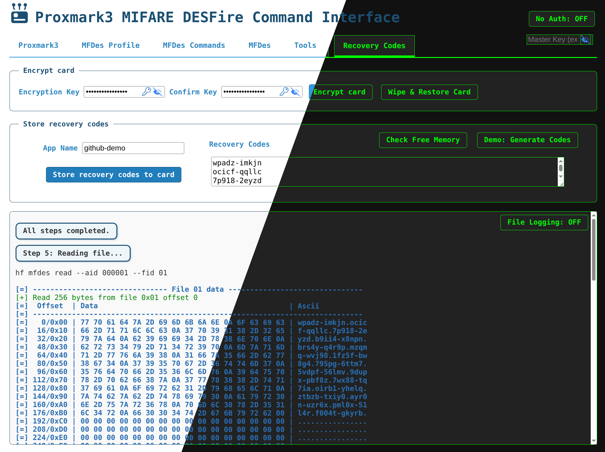

# Proxmark3 MIFARE DESFire Web Interface

 A web-based interface for sending MIFARE DESFire commands to a Proxmark3 device.  

**Main Goal:** Securely store recovery codes on a MIFARE DESFire card.


> On **MIFARE DESFire EV3 4K** card with **5120 bytes** free memory (even though 4K = 4096 bytes), you can store up to **7 apps** (about 680 bytes per app), each with **16 recovery codes** (e.g., GitHub)



### Useful Links

- [Proxmark3Commands](https://github.com/SasPes/Proxmark3Commands)
- [MIFARE DESFire Guide](https://github.com/SasPes/Proxmark3Commands/blob/main/MIFARE%20DESFire.md)

## Features

- Start and control the Proxmark3 shell from your browser
- Manage MFDes profiles and keys (set, get, change, master key)
- Create, delete, and list DESFire applications and files
- Read and write file data
- String \<-\> Hex conversion tools
- "No Auth" toggle for testing
- Tabbed and sub-tabbed UI for easy navigation
- Output highlighting for command results
- Automatic dropdown population for AIDs and FIDs
- All commands and their outputs are optionally logged to the `log` directory

### Store Recovery Codes Workflows

#### Encrypt Card Button

1. Start Proxmark3
2. Set Master Key
3. Set profile

#### Store Recovery Codes

1. Check if app exists, create if not
2. Set App Key
3. Create File
4. Write to File
5. Read file

#### Wipe & Restore Card

1. Check Free Memory
2. Format Card
3. Check Free Memory
4. Set default (DES/0...0)
5. Set default profile
6. Get profile

---

## Quick Start

### Requirements

- Python 3.8+
- [Proxmark3](https://github.com/Proxmark/proxmark3) (built and accessible)
- [FastAPI](https://fastapi.tiangolo.com/)
- [pexpect](https://pexpect.readthedocs.io/en/stable/)
- [Uvicorn](https://www.uvicorn.org/)

### Installation

1. **Clone the repository:**
    ```bash
    git clone https://github.com/SasPes/proxmark3-hf-mfdes-web.git
    cd proxmark3-hf-mfdes-web
    ```

2. **Install dependencies:**
    ```bash
    pip install fastapi pexpect uvicorn
    ```

3. **Ensure your Proxmark3 binary is available (default: `../proxmark3/pm3`).**

### Running the Server

```bash
uvicorn main:app --reload
```

Open your browser and go to [http://localhost:8000](http://localhost:8000).

## Desktop App

### Linux

#### Fedora

To run the desktop version (with a built-in browser window):

1. **Install pywebview:**
    ```bash
    pip install pywebview
    ```

2. **Package the app with PyInstaller:**
    ```bash
    pyinstaller --onefile --add-data "static:static" desktop.py --name proxmark3-hf-mfdes
    ```

---

## Usage Overview

Use the tabs to access different features:

- **Proxmark3**  
  - Set the Proxmark3 executable path and start the shell

- **MFDes Profile**  
  - Get or set the default MFDes profile (key and type)

- **MFDes Commands**  
  - Run common MFDes commands (e.g., HF Search, Free Memory, Info, List Apps)

- **MFDes (Card/App/File/Delete)**  
  - Set or reset card master key
  - Create or delete MFDes applications and files
  - Set app keys
  - Write/read file data
  - Format card

- **Tools**  
  - Convert between string and hex representations

**Other features:**
- "No Auth" toggle disables authentication for supported commands
- Dropdowns for AID and FID auto-populate after loading apps
- Output and command results are color-highlighted

## Notes

- The backend uses pexpect to control the Proxmark3 shell
- Some features require a connected Proxmark3 device
- All communication is via HTTP GET requests from the frontend to the FastAPI backend
## License

MIT License 
